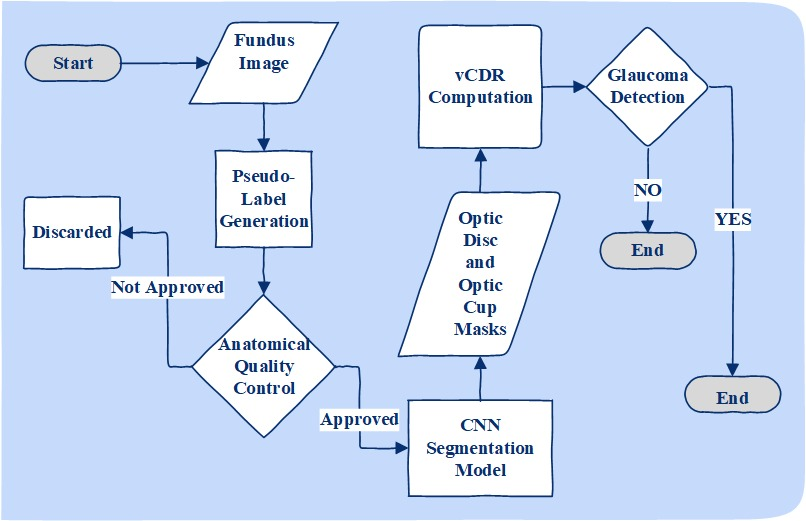
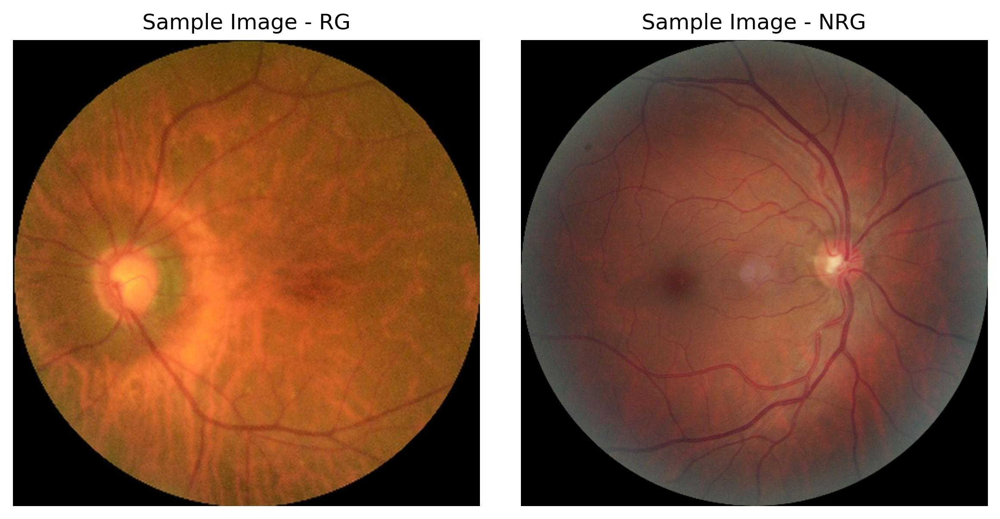

# 🩺 Weakly Supervised Optic Disc and Cup Segmentation for Glaucoma Screening


This repository presents a **weakly supervised framework** for optic disc (OD) and optic cup (OC) segmentation from retinal fundus images, developed for automated glaucoma screening. 

The approach removes the reliance on pixel-level expert annotations by leveraging **anatomically guided pseudo-labels** generated from unannotated data, making it a scalable solution for large-scale deployment.

---

## 🎯 Motivation

Accurate glaucoma screening relies on morphological analysis of the optic nerve head, particularly the **Cup-to-Disc Ratio (vCDR)**. However, pixel-level annotations are costly, subjective, and difficult to scale.

This project addresses these limitations by:
* **Pseudo-Label Training:** Training segmentation models entirely on synthesized data.
* **Clinical Priors:** Enforcing anatomical constraints during label generation.
* **Interpretable Outputs:** Producing direct segmentation masks without post-hoc black-box classifiers.

---

## 🧠 Method Overview

The proposed framework consists of three main components:

### 1. Pseudo-Label Generation
Pseudo-labels for OD and OC are automatically generated using anatomically guided heuristics:
* **Intensity Contrast:** Brightness cues to identify the cup.
* **Circularity Constraints:** Approximating the natural shape of the optic nerve head.
* **Spatial Consistency:** Ensuring the cup is contained within the disc.
* **Ratio Priors:** Using clinically motivated area ratios.


> **Note:** Morphological post-processing is applied to reduce noise and enforce structural plausibility.

### 2. Weakly Supervised Segmentation
Segmentation networks are trained using pseudo-labels as weak supervision:
* **Architecture:** U-Net–based variants with ImageNet-pretrained encoders.
* **Hybrid Loss:** Designed to address class imbalance, boundary uncertainty, and label noise.



*Figure: Pipeline diagram (Input → Pseudo-labels → Segmentation → vCDR).*

### 3. Clinical Metric Extraction
Pixel-level predictions are directly converted into **Vertical Cup-to-Disc Ratio (vCDR)** measurements, enabling end-to-end screening.

---

## 📊 Datasets

| Dataset | Training Role | Evaluation Role | Annotations Used |
| :--- | :--- | :--- | :--- |
| **EyePACS** | Primary | - | Pseudo-labels (Weak) |
| **REFUGE2** | - | External Validation | Expert Masks (Ground Truth) |



---

## ⚙️ Training Strategy

* **Optimizer:** Adam with adaptive learning rate scheduling.
* **Refinement:** Selective encoder pretraining and dynamic loss adjustment across training phases to balance robustness against noise.
* **Augmentation:** Standardized strategies across all experimental variants.

---

## 🔬 Scope of This Repository

This repository documents the methodology and supports the reproducibility of the proposed framework. It accompanies an academic manuscript currently **under submission**.

*Please note: Raw datasets are not included due to licensing constraints.*

---

## 📜 Citation

If you use or build upon this work, please cite:

```bibtex
@article{abbas2026weakly,
  title={Weakly Supervised Optic Disc and Cup Segmentation Using Pseudo-Labels for Glaucoma Screening},
  author={Meesam Abbas, Abdul Rauf},
  journal={Under Review},
  year={2026}
}
